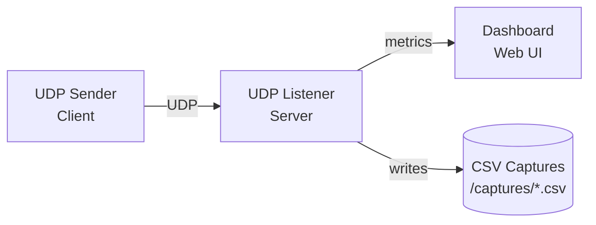

<p align="center">
  
</p>

<p align="center">
  
  
  
</p>

UDP testing toolkit: capture, send, and visualize UDP traffic.

## Overview

Three containerized Go applications for UDP traffic capture, transmission, and monitoring. Useful for testing UDP endpoints, simulating IoT devices, and debugging network issues.

## Components

### [UDP Listener](./udp-listener/README.md)

Receives UDP packets and logs them to CSV files.

- CSV logging (timestamp, source IP, payload size, message)
- Reply/ACK mode (simple or enhanced format)
- AES-256-GCM decryption
- File reception mode
- Test mode with sequence tracking for drop analysis
- Metrics reporting to dashboard

```bash
docker build -f udp-listener/Dockerfile -t udp-listener:latest udp-listener
docker run -p 9000:9000/udp -v ./captures:/captures udp-listener:latest
```

---

### TCP/TLS Listener *(WIP)*

TCP equivalent of UDP listener with optional TLS (`crypto/tls`). Same CSV capture + metrics model. Not yet implemented.

---

### [Dashboard](./dashboard/README.md)

Web UI for viewing traffic flows and metrics.

- Sankey flow diagrams
- Packet counts, latency, success rates
- Time-based filtering (5m to 24h)
- WebSocket updates

```bash
docker build -f dashboard/Dockerfile -t dashboard:latest dashboard
docker run -p 8080:8080 dashboard:latest
```

---

### [UDP Sender](./udp-sender/README.md)

CLI for sending UDP packets.

- Text messages or binary files
- Chunked file transmission
- AES-256-GCM encryption
- Timestamp injection for latency measurement
- PW-Test mode for drop analysis
- Continuous/burst sending modes

```bash
docker build -f udp-sender/Dockerfile -t udp-sender:latest udp-sender
docker run --rm udp-sender --target 192.168.1.100:9000 --message "TEST"
```

---

### TCP/TLS Sender *(WIP)*

TCP equivalent of UDP sender with optional TLS (`crypto/tls`). Length-prefixed framing. Not yet implemented.

---

## Architecture



## Quick Start

Pull the pre-built images:

```bash
docker pull ghcr.io/malindarathnayake/packet-wire-udp-listener:latest
docker pull ghcr.io/malindarathnayake/packet-wire-udp-sender:latest
```

Run the listener:

```bash
docker run -p 9000:9000/udp -v ./captures:/captures \
  ghcr.io/malindarathnayake/packet-wire-udp-listener:latest
```

Send a test packet:

```bash
docker run --rm ghcr.io/malindarathnayake/packet-wire-udp-sender:latest \
  --target host.docker.internal:9000 --message "TEST"
```

## All Services (Docker Compose)

### Using Docker Compose

```yaml
services:
  dashboard:
    image: ghcr.io/malindarathnayake/packet-wire-dashboard:latest
    ports:
      - "8080:8080"
    networks:
      - packet-wire

  udp-listener:
    image: ghcr.io/malindarathnayake/packet-wire-udp-listener:latest
    ports:
      - "9000:9000/udp"
    environment:
      - CLIENT_ID=listener-01
      - DASHBOARD_URL=http://dashboard:8080/api/metrics
    volumes:
      - ./captures:/captures
    networks:
      - packet-wire

  udp-sender:
    image: ghcr.io/malindarathnayake/packet-wire-udp-sender:latest
    command: >
      --target udp-listener:9000
      --message "Hello from sender"
      --interval 5s
    networks:
      - packet-wire

networks:
  packet-wire:
    driver: bridge
```

### Manual Build 

```bash
# Build all images
docker build -f udp-listener/Dockerfile -t udp-listener:latest udp-listener
docker build -f udp-sender/Dockerfile -t udp-sender:latest udp-sender
docker build -f dashboard/Dockerfile -t dashboard:latest dashboard

# Run dashboard
docker run -d -p 8080:8080 --name dashboard dashboard:latest

# Run listener with metrics
docker run -d -p 9000:9000/udp \
  -e CLIENT_ID=listener-01 \
  -e DASHBOARD_URL=http://host.docker.internal:8080/api/metrics \
  -v ./captures:/captures \
  --name udp-listener \
  udp-listener:latest

# Send test packets
docker run --rm udp-sender \
  --target host.docker.internal:9000 \
  --message "PLTESTMESSAGE"
```

## Container Images

Images are automatically built and published to GitHub Container Registry on commits to main:

- `ghcr.io/malindarathnayake/packet-wire-udp-listener:latest`
- `ghcr.io/malindarathnayake/packet-wire-udp-sender:latest`
- `ghcr.io/malindarathnayake/packet-wire-dashboard:latest`

Pull the latest images:
```bash
docker pull ghcr.io/malindarathnayake/packet-wire-dashboard:latest
docker pull ghcr.io/malindarathnayake/packet-wire-udp-listener:latest
docker pull ghcr.io/malindarathnayake/packet-wire-udp-sender:latest
```

## Development

### Prerequisites
- Go 1.22+
- Docker & Docker Compose
- Git

### Build from Source

Each component can be built independently:

```bash
# UDP Listener
cd udp-listener && go build -o udp-listener .

# UDP Sender
cd udp-sender && go build -o udp-sender .

# Dashboard
cd dashboard && go build -o dashboard-server server.go
```

## Deployment

Ready-to-use Docker Compose configurations are available in the [`deploy/`](./deploy/) directory:

- **Basic Setup:** Dashboard + UDP Listener
- **Full Stack:** Dashboard + UDP Listener + UDP Sender
- **Config Files:** Pre-configured settings for each service

See [Deployment Guide](./deploy/README.md) for detailed instructions.

## Documentation


- [API Reference](./_docs/api-reference.md)
- [Dashboard Metrics Spec](./_docs/dashboard-metrics-spec.md)
- [PW-Test Workflow](./_docs/test-workflow.md) - Drop analysis and packet testing

## License

This project is licensed under the MIT License - see the [LICENSE](LICENSE) file for details.

