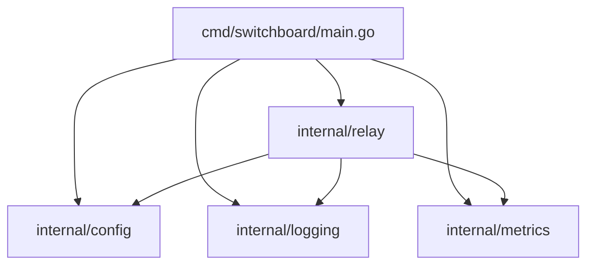

# UDP Switchboard - Implementation Guide

Comprehensive documentation for the UDP Switchboard codebase. Reference this document before making changes or adding new features.

---

## Table of Contents

1. [Architecture Overview](#architecture-overview)
2. [Package Structure](#package-structure)
3. [Core Components](#core-components)
4. [Data Flow](#data-flow)
5. [Configuration System](#configuration-system)
6. [Concurrency Model](#concurrency-model)
7. [Error Handling](#error-handling)
8. [Metrics & Logging](#metrics--logging)
9. [Lifecycle Management](#lifecycle-management)
10. [Extension Points](#extension-points)

---

## Architecture Overview

### High-Level Design

```
┌─────────────────────────────────────────────────────────────────────────┐
│                           UDP Switchboard                                │
├─────────────────────────────────────────────────────────────────────────┤
│                                                                          │
│  ┌──────────────┐    ┌──────────────────────────────────────────────┐   │
│  │   main.go    │───▶│            ListenerManager                    │   │
│  │  (entry)     │    │  ┌────────────────────────────────────────┐  │   │
│  └──────────────┘    │  │  Listener (Port 18172)                 │  │   │
│         │            │  │   └─▶ PacketHandler                    │  │   │
│         │            │  │        └─▶ Forward to 207.x.x.x:18172  │  │   │
│         ▼            │  ├────────────────────────────────────────┤  │   │
│  ┌──────────────┐    │  │  Listener (Port 8807)                  │  │   │
│  │    Config    │    │  │   └─▶ PacketHandler                    │  │   │
│  │   (YAML +    │    │  │        └─▶ Forward to 209.x.x.x:8807   │  │   │
│  │    Routes)   │    │  ├────────────────────────────────────────┤  │   │
│  └──────────────┘    │  │  Listener (Port N)                     │  │   │
│                      │  │   └─▶ PacketHandler                    │  │   │
│                      │  └────────────────────────────────────────┘  │   │
│                      └──────────────────────────────────────────────┘   │
│                                       │                                  │
│                    ┌──────────────────┼──────────────────┐               │
│                    ▼                  ▼                  ▼               │
│             ┌──────────┐       ┌──────────┐       ┌──────────┐          │
│             │  Logger  │       │ Metrics  │       │ Shutdown │          │
│             │  (GELF)  │       │ (InfluxDB)│      │ Handler  │          │
│             └──────────┘       └──────────┘       └──────────┘          │
│                                                                          │
└─────────────────────────────────────────────────────────────────────────┘
```

### Design Principles

| Principle | Implementation |
|-----------|----------------|
| **One goroutine per listener** | Each port has dedicated listener goroutine |
| **One goroutine per packet** | Packet handling spawned as new goroutine |
| **Dial-per-packet** | No connection pooling - each relay dials fresh |
| **Non-blocking metrics** | Buffered channel prevents relay blocking |
| **Graceful shutdown** | Context cancellation + in-flight tracking |

---

## Package Structure

```
udp-switchboard/
├── cmd/
│   └── switchboard/
│       └── main.go              # Application entry point, lifecycle
│
├── internal/
│   ├── config/
│   │   ├── config.go            # YAML config loading + validation
│   │   └── routes.go            # JSON routes loading + validation
│   │
│   ├── logging/
│   │   └── gelf.go              # GELF logger with stdout fallback
│   │
│   ├── metrics/
│   │   └── influx.go            # Async InfluxDB writer with buffering
│   │
│   └── relay/
│       ├── handler.go           # Per-packet relay logic
│       └── listener.go          # UDP socket management
│
├── config/
│   ├── config.yaml              # Application configuration
│   └── routes.json              # Port→IP routing table
│
└── _docs/
    ├── udp-switchboard-spec.md  # Specification document
    ├── engineering-standards.md # Code standards reference
    └── implementation-guide.md  # This document
```

### Package Dependencies



---

## Core Components

### 1. Entry Point (`cmd/switchboard/main.go`)

**Responsibilities:**
- Parse configuration path from env/defaults
- Execute 6-phase startup sequence
- Handle OS signals (SIGTERM, SIGINT)
- Orchestrate graceful shutdown
- Convert errors to exit codes

**Key Functions:**

| Function | Purpose |
|----------|---------|
| `main()` | Entry point, panic recovery, exit code handling |
| `run()` | Startup sequence orchestration |
| `gracefulShutdown()` | Coordinated shutdown with drain period |

**Startup Phases:**

```go
// Phase 1: Load configuration
appConfig, err := config.LoadConfig(configPath)

// Phase 2: Load routes
routes, err := config.LoadRoutes(appConfig.App.RoutesFile)

// Phase 3: Initialize metrics (non-fatal on failure)
metricsWriter, err := metrics.NewMetricsWriter(metricsConfig)

// Phase 4: Initialize logging
logger, err := logging.NewLogger(...)

// Phase 5: Bind UDP listeners
listenerManager := relay.NewListenerManager(...)
listenerManager.StartAll()

// Phase 6: Ready - enter main loop
```

---

### 2. Configuration (`internal/config/`)

#### config.go - Application Settings

**Structs:**

```go
type Config struct {
    App     AppConfig     // Core app settings
    Logging LoggingConfig // Log level, GELF config
    Metrics MetricsConfig // InfluxDB settings
}

type AppConfig struct {
    BindIP                     string // Listen address (default: 0.0.0.0)
    ResponseTimeoutMs          int    // ACK timeout in milliseconds
    ShutdownGracePeriodSeconds int    // Drain time on shutdown
    RoutesFile                 string // Path to routes.json
}
```

**Environment Overrides:**

| Env Variable | Config Path | Purpose |
|--------------|-------------|---------|
| `CONFIG_PATH` | - | Config file location |
| `LOG_LEVEL` | `logging.level` | Log verbosity |
| `GELF_HOST` | `logging.gelf.host` | Graylog host |
| `GELF_PORT` | `logging.gelf.port` | Graylog port |
| `INFLUX_URL` | `metrics.influxdb.url` | InfluxDB endpoint |
| `INFLUX_TOKEN` | `metrics.influxdb.token` | InfluxDB auth token |
| `INFLUX_ORG` | `metrics.influxdb.org` | InfluxDB organization |
| `INFLUX_BUCKET` | `metrics.influxdb.bucket` | InfluxDB bucket |

#### routes.go - Routing Table

**Structs:**

```go
type Route struct {
    Port     int    `json:"port"`              // Listen port
    Target   string `json:"target"`            // Backend IP
    Customer string `json:"customer,omitempty"` // Metrics label
    Device   string `json:"Device,omitempty"`   // Metrics label
}

type Routes struct {
    Routes []Route `json:"routes"`
}
```

**Validation Rules:**
- Port must be 1-65535
- No duplicate ports allowed
- Target must be valid IPv4 (IPv6 not supported)
- At least one route required

**Helper Methods:**

| Method | Returns | Use Case |
|--------|---------|----------|
| `GetPortList()` | `[]int` | All configured ports |
| `GetRouteByPort(port)` | `*Route, bool` | Lookup by port |
| `GetPortRange()` | `min, max int` | Display port range |

---

### 3. Logging (`internal/logging/gelf.go`)

**Log Levels:**

| Level | GELF Code | When to Use |
|-------|-----------|-------------|
| DEBUG | 7 | Per-packet tracing, detailed diagnostics |
| INFO | 6 | Startup/shutdown, configuration events |
| WARN | 4 | Degraded state, fallbacks activated |
| ERROR | 3 | Failures affecting functionality |

**Output Modes:**
- **GELF enabled**: Structured JSON to Graylog server
- **GELF disabled/unavailable**: Formatted text to stdout

**Structured Fields:**

All log entries include:
- `_component`: Source component (main, relay, config, listener)
- `_event_type`: Event category (startup, runtime, error, shutdown)

**Pre-defined Events:**

| Method | Event | Extra Fields |
|--------|-------|--------------|
| `LogStartupComplete()` | Successful boot | `routes_count`, `startup_duration_ms` |
| `LogShutdownInitiated()` | SIGTERM received | `in_flight_count` |
| `LogShutdownComplete()` | Clean exit | `drain_duration_ms` |
| `LogRouteError()` | Backend failures | `port`, `target`, `error_count` |
| `LogBindFailed()` | Port unavailable | `port`, `error` |

---

### 4. Metrics (`internal/metrics/influx.go`)

**Architecture:**

```
   Goroutine 1                   Goroutine 2
┌──────────────┐              ┌──────────────────┐
│ PacketHandler │──────────▶  │  Metrics Buffer  │
│  .Record...() │  (non-     │  (chan, 10k cap) │
└──────────────┘   blocking)  └────────┬─────────┘
                                       │
                                       ▼
                              ┌──────────────────┐
                              │ backgroundWriter │
                              │  - Batch (100)   │
                              │  - Flush (10s)   │
                              │  - Retry (3x)    │
                              └────────┬─────────┘
                                       │
                                       ▼
                              ┌──────────────────┐
                              │    InfluxDB      │
                              └──────────────────┘
```

**Measurements:**

| Name | Tags | Fields | Frequency |
|------|------|--------|-----------|
| `udp_relay` | port, target, status, customer, device | latency_ms, count | Per-packet |
| `udp_relay_errors` | port, target, error_type, customer, device | count | Per-error |
| `udp_switchboard_status` | instance | routes_active, uptime_seconds | Every flush interval |

**Status Values:** `success`, `timeout`, `error`  
**Error Types:** `timeout`, `dial_failed`, `write_failed`, `read_failed`

**Buffer Behavior:**
- Capacity: 10,000 measurements
- Overflow: Drop measurement (log warning)
- Flush triggers: Batch full (100) OR timer (configurable seconds)

**Retry Logic:**
- Attempts: 3 (configurable via `maxRetries`)
- Backoff: Exponential (5s, 10s, 20s) + jitter
- On exhaustion: Drop batch, log error, continue

---

### 5. Relay (`internal/relay/`)

#### handler.go - Packet Processing

**Flow per packet:**

```
1. Receive packet + client address
           │
           ▼
2. Resolve target address (route.Target:route.Port)
           │
           ▼
3. Dial UDP to backend (net.DialUDP)
           │
           ▼
4. Set deadline (now + responseTimeout)
           │
           ▼
5. Write packet to backend
           │
           ▼
6. Read ACK from backend (blocks until deadline)
           │
           ├─▶ Success: Return ACK + record success metric
           │
           └─▶ Timeout/Error: Record error metric, return nil
```

**Key Methods:**

| Method | Returns | Use |
|--------|---------|-----|
| `HandlePacket()` | void | Fire-and-forget relay |
| `HandlePacketWithResult()` | `*RelayResult` | Relay with result for ACK forwarding |

**RelayResult Structure:**

```go
type RelayResult struct {
    Success    bool      // True if ACK received
    ACK        []byte    // ACK payload (if success)
    Error      error     // Error details (if failed)
    ErrorType  string    // Classification: timeout, dial_failed, etc.
    StartTime  time.Time // For latency calculation
}
```

#### listener.go - Socket Management

**Listener (per port):**

```go
type Listener struct {
    route           *config.Route     // Port/target config
    socket          *net.UDPConn      // Bound UDP socket
    handler         *PacketHandler    // Relay logic
    logger          *logging.Logger   // Logging
    ctx             context.Context   // Shutdown signal
    cancel          context.CancelFunc
    wg              sync.WaitGroup    // Goroutine tracking
    inFlightCounter int64             // Atomic in-flight count
    bindIP          string            // Listen address
}
```

**ListenerManager (all ports):**

```go
type ListenerManager struct {
    listeners     []*Listener           // All active listeners
    logger        *logging.Logger
    metricsWriter *metrics.MetricsWriter
    config        *config.Config
    routes        *config.Routes
    ctx           context.Context       // Shutdown signal
    cancel        context.CancelFunc
    wg            sync.WaitGroup        // Status reporter tracking
}
```

**Listen Loop:**

```go
for {
    // 1. Check shutdown signal
    select {
    case <-l.ctx.Done():
        return
    default:
    }
    
    // 2. Set 1s read timeout (for shutdown responsiveness)
    socket.SetReadDeadline(time.Now().Add(1 * time.Second))
    
    // 3. Read packet (blocks up to 1s)
    packetLength, clientAddr, err := socket.ReadFromUDP(buffer)
    
    // 4. Handle timeout (continue loop, check shutdown)
    // 5. Handle real errors (log, continue)
    
    // 6. Increment in-flight counter
    atomic.AddInt64(&l.inFlightCounter, 1)
    
    // 7. Spawn handler goroutine
    go l.handlePacketAsync(packet, clientAddr)
}
```

---

## Data Flow

### Complete Packet Journey

```
        IoT Device                    UDP Switchboard                     Backend
            │                               │                                │
            │  UDP packet to port 18172     │                                │
            │──────────────────────────────▶│                                │
            │                               │                                │
            │                      ┌────────┴────────┐                       │
            │                      │ 1. Listener     │                       │
            │                      │    receives     │                       │
            │                      │    packet       │                       │
            │                      └────────┬────────┘                       │
            │                               │                                │
            │                      ┌────────┴────────┐                       │
            │                      │ 2. Spawn        │                       │
            │                      │    handler      │                       │
            │                      │    goroutine    │                       │
            │                      └────────┬────────┘                       │
            │                               │                                │
            │                               │  UDP to 207.x.x.x:18172        │
            │                               │───────────────────────────────▶│
            │                               │                                │
            │                               │  ACK response                  │
            │                               │◀───────────────────────────────│
            │                               │                                │
            │                      ┌────────┴────────┐                       │
            │                      │ 3. Record       │                       │
            │                      │    metrics      │                       │
            │                      │    (async)      │                       │
            │                      └────────┬────────┘                       │
            │                               │                                │
            │  ACK relayed to device        │                                │
            │◀──────────────────────────────│                                │
            │                               │                                │
```

### Metrics Data Flow

```
┌─────────────────┐     ┌─────────────────┐     ┌─────────────────┐
│  PacketHandler  │────▶│  Channel Buffer │────▶│ backgroundWriter│
│  RecordMetric() │     │  (10k capacity) │     │  (batches/flush)│
└─────────────────┘     └─────────────────┘     └────────┬────────┘
        │                                                 │
        │ Non-blocking                                    │ Blocking
        │ (select with default)                          │ (retry logic)
        │                                                 │
        ▼                                                 ▼
   Returns immediately                              ┌──────────┐
   (never blocks relay)                             │ InfluxDB │
                                                    └──────────┘
```

---

## Concurrency Model

### Goroutine Inventory

| Goroutine | Count | Lifetime | Purpose |
|-----------|-------|----------|---------|
| Main | 1 | App lifetime | Signal handling, orchestration |
| Listener | N (routes) | App lifetime | UDP socket read loop |
| Packet Handler | Unbounded | Per-packet | Forward + ACK relay |
| Metrics Writer | 1 | App lifetime | Batch writes to InfluxDB |
| Status Reporter | 1 | App lifetime | Periodic heartbeat metrics |
| InfluxDB Test | 1 | Startup only | Async connection test |

### Shared State Protection

| State | Writers | Readers | Protection |
|-------|---------|---------|------------|
| `Listener.inFlightCounter` | Handler goroutines | Shutdown logic | `sync/atomic` |
| `MetricsWriter.connected` | Writer, test goroutine | GetStats() | `sync.RWMutex` |
| `MetricsWriter.retryCount` | Writer goroutine | GetStats() | `sync.RWMutex` |
| `MetricsWriter.buffer` | Handlers | Writer | Buffered channel (thread-safe) |

### Shutdown Coordination

```
    SIGTERM/SIGINT
          │
          ▼
┌─────────────────────┐
│ Stop accepting new  │
│ connections         │
│ (cancel context)    │
└──────────┬──────────┘
           │
           ▼
┌─────────────────────┐
│ Wait for in-flight  │◀─── WaitForGracefulShutdown()
│ (poll inFlightCount)│     polls every 100ms
│ up to grace period  │
└──────────┬──────────┘
           │
           ▼
┌─────────────────────┐
│ Close listener      │
│ sockets             │
└──────────┬──────────┘
           │
           ▼
┌─────────────────────┐
│ Flush metrics       │
│ Close InfluxDB      │
└──────────┬──────────┘
           │
           ▼
       Exit(0)
```

---

## Error Handling

### Error Classification

| Category | Example | Response |
|----------|---------|----------|
| **Config Error** | Missing YAML, invalid port | Exit(1), log error |
| **Bind Error** | Port in use, permission denied | Exit(1), log port |
| **Backend Error** | Dial fail, timeout, write fail | Record metric, continue |
| **Metrics Error** | InfluxDB unavailable | Log warning, continue without metrics |
| **Log Error** | GELF unavailable | Fallback to stdout |

### Error Propagation Pattern

```go
// Library code - raise exceptions
func LoadConfig(path string) (*Config, error) {
    if err := validate(config); err != nil {
        return nil, fmt.Errorf("invalid configuration: %w", err)
    }
    return config, nil
}

// main() - convert to exit codes
func main() {
    if err := run(); err != nil {
        fmt.Fprintf(os.Stderr, "ERROR: %v\n", err)
        os.Exit(1)
    }
}
```

### Per-Component Error Handling

| Component | Error | Action |
|-----------|-------|--------|
| config.LoadConfig | File not found | Return error → Exit(1) |
| config.LoadRoutes | Invalid JSON | Return error → Exit(1) |
| metrics.NewMetricsWriter | Connection fail | Return partial (disabled) → Continue |
| logging.NewLogger | GELF fail | Log warning → Use stdout |
| listener.Start | Bind fail | Return error → Exit(1) |
| handler.HandlePacket | Backend fail | Record metric → Return (device retries) |

---

## Lifecycle Management

### Startup Sequence Diagram

```
main()
  │
  ├─▶ Load config.yaml
  │     └─▶ Apply env overrides
  │     └─▶ Validate
  │
  ├─▶ Load routes.json
  │     └─▶ Validate all routes
  │     └─▶ Check for duplicates
  │
  ├─▶ Init MetricsWriter
  │     └─▶ Connect InfluxDB (async)
  │     └─▶ Start background writer
  │
  ├─▶ Init Logger
  │     └─▶ Connect GELF (or fallback)
  │
  ├─▶ Start ListenerManager
  │     └─▶ For each route:
  │           └─▶ Create Listener
  │           └─▶ Bind UDP socket
  │           └─▶ Start listen goroutine
  │     └─▶ Start status reporter
  │
  └─▶ Enter signal wait loop
```

### Shutdown Sequence Diagram

```
SIGTERM received
  │
  ├─▶ Log "shutdown_initiated"
  │
  ├─▶ Cancel ListenerManager context
  │     └─▶ Listener loops detect ctx.Done()
  │     └─▶ Status reporter stops
  │
  ├─▶ WaitForGracefulShutdown(grace_period)
  │     └─▶ Poll in-flight counts
  │     └─▶ Return when 0 or timeout
  │
  ├─▶ StopAll() listeners
  │     └─▶ Close each socket
  │     └─▶ Wait for listen goroutines
  │
  ├─▶ Flush metrics buffer
  │     └─▶ Drain channel
  │     └─▶ Write final batch
  │
  ├─▶ Close InfluxDB client
  │
  ├─▶ Close GELF writer
  │
  └─▶ Log "shutdown_complete"
      └─▶ Exit(0)
```

---

## Extension Points

### Adding a New Feature

For features like **dual mirroring**, consider these extension points:

#### 1. Route Configuration Extension

```go
// routes.go - Add mirror target field
type Route struct {
    Port       int      `json:"port"`
    Target     string   `json:"target"`
    MirrorTo   []string `json:"mirror_to,omitempty"`  // NEW: Mirror targets
    Customer   string   `json:"customer,omitempty"`
    Device     string   `json:"Device,omitempty"`
}
```

#### 2. Handler Extension

```go
// handler.go - Add mirror logic
func (h *PacketHandler) HandlePacketWithResult(packet []byte, clientAddr *net.UDPAddr) *RelayResult {
    // Primary relay (existing)
    result := h.relayToTarget(packet, h.route.Target)
    
    // Mirror relay (NEW)
    if len(h.route.MirrorTo) > 0 {
        for _, mirrorTarget := range h.route.MirrorTo {
            go h.relayToMirror(packet, mirrorTarget)  // Fire-and-forget
        }
    }
    
    return result
}
```

#### 3. Metrics Extension

```go
// influx.go - Add mirror metrics
func (w *MetricsWriter) RecordMirrorMetric(port int, target, status string, latencyMs float64) {
    measurement := &Measurement{
        Name: "udp_relay_mirror",
        Tags: map[string]string{
            "port":   fmt.Sprintf("%d", port),
            "target": target,
            "status": status,
        },
        Fields: map[string]interface{}{
            "latency_ms": latencyMs,
            "count":      1,
        },
        Timestamp: time.Now(),
    }
    w.sendMeasurement(measurement)
}
```

### Adding New Metrics

1. Add method to `MetricsWriter` in `internal/metrics/influx.go`
2. Define measurement name, tags, and fields
3. Call from appropriate location (handler, listener, etc.)
4. Document in spec's Metrics section

### Adding New Log Events

1. Add method to `Logger` in `internal/logging/gelf.go`
2. Define event name, level, and structured fields
3. Call from appropriate location
4. Document in spec's GELF Log Events section

### Adding New Configuration

1. Add struct field to appropriate config type in `internal/config/config.go`
2. Add validation rule in `validateConfig()`
3. Add env override in `applyEnvironmentOverrides()` if needed
4. Update config.yaml template
5. Document in spec's Config Schema section

---

## Testing Considerations

### Manual Testing

```bash
# Send test packet
echo "test" | nc -u localhost 18172

# Watch logs
docker-compose logs -f

# Check metrics in InfluxDB
influx query 'from(bucket: "switchboard") |> range(start: -1h)'
```

### Key Test Scenarios

| Scenario | What to Verify |
|----------|----------------|
| Normal relay | Packet forwarded, ACK returned, metrics recorded |
| Backend timeout | Timeout metric recorded, no ACK to device |
| Backend unreachable | dial_failed metric, graceful handling |
| Graceful shutdown | In-flight requests complete, metrics flushed |
| Config validation | Invalid config rejected with clear error |
| Port conflict | Bind failure logged, exit(1) |
| Metrics buffer full | Warning logged, relay not blocked |

---

## Performance Characteristics

### Resource Usage (per 100 routes)

| Resource | Idle | Active (10 pkt/s/route) |
|----------|------|-------------------------|
| Goroutines | ~105 | ~1100 (peak) |
| Memory | ~50MB | ~150MB |
| CPU | <1% | 10-20% |
| File descriptors | ~200 | ~400 |

### Bottlenecks

| Bottleneck | Symptom | Mitigation |
|------------|---------|------------|
| Metrics buffer full | "Metrics buffer full" warnings | Increase buffer size or flush interval |
| Too many goroutines | High memory, slow response | Reduce concurrent packets per port |
| Backend latency | High p99 latency | Reduce response_timeout_ms |
| Socket buffers | Packet drops under load | Increase OS buffer sizes |

---

## Appendix: Quick Reference

### File → Responsibility

| File | Primary Responsibility |
|------|------------------------|
| `main.go` | App lifecycle, signal handling |
| `config/config.go` | YAML parsing, validation, env overlays |
| `config/routes.go` | JSON parsing, route validation |
| `logging/gelf.go` | Structured logging, GELF/stdout |
| `metrics/influx.go` | Async InfluxDB writes, buffering |
| `relay/handler.go` | Single packet relay logic |
| `relay/listener.go` | UDP socket binding, goroutine mgmt |

### Config Value → Location

| Setting | File | Env Override |
|---------|------|--------------|
| Listen IP | config.yaml `app.bind_ip` | - |
| ACK timeout | config.yaml `app.response_timeout_ms` | - |
| Routes file | config.yaml `app.routes_file` | - |
| Log level | config.yaml `logging.level` | `LOG_LEVEL` |
| GELF host | config.yaml `logging.gelf.host` | `GELF_HOST` |
| InfluxDB URL | config.yaml `metrics.influxdb.url` | `INFLUX_URL` |

### Error Type → Impact

| Error Type | User Impact | Logged | Metric |
|------------|-------------|--------|--------|
| `timeout` | Device retries | DEBUG | Yes |
| `dial_failed` | Device retries | DEBUG | Yes |
| `write_failed` | Device retries | DEBUG | Yes |
| `read_failed` | Device retries | DEBUG | Yes |
| Config error | Service won't start | ERROR | No |
| Bind error | Service won't start | ERROR | No |
