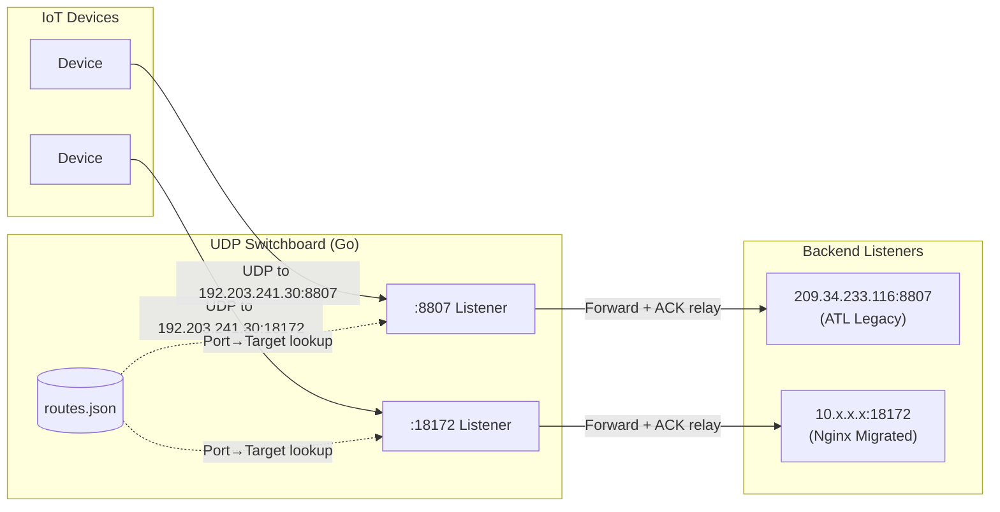

# UDP Switchboard - Spec

## Intent
UDP relay that decouples IoT device configuration (static IP) from backend routing (ATL legacy vs Nginx), enabling customer migration without touching device settings. Port-based routing table maps incoming UDP ports to target backend IPs.

## Architecture



### Packet Flow (per request)
1. Device sends UDP packet to `<relay_ip>:<port>`
2. Listener receives packet, looks up target IP from route table
3. Forward packet to `<target_ip>:<same_port>`
4. Wait for ACK from backend (with timeout)
5. Relay ACK back to device
6. Record metrics (async, non-blocking)

## Config Schema

### `config.yaml` - Application Settings

```yaml
app:
  bind_ip: "0.0.0.0"                    # Listen address
  response_timeout_ms: 2000             # ACK wait timeout
  shutdown_grace_period_seconds: 5      # Drain time on SIGTERM
  routes_file: "/etc/switchboard/routes.json"

logging:
  level: "info"                         # debug, info, warn, error
  gelf:
    enabled: true
    host: "from env var: GELF_HOST"
    port: "from env var: GELF_PORT"
    facility: "udp-switchboard"

metrics:
  influxdb:
    enabled: true
    url: "from env var: INFLUX_URL"
    token: "from env var: INFLUX_TOKEN"
    org: "from env var: INFLUX_ORG"
    bucket: "from env var: INFLUX_BUCKET"
    flush_interval_seconds: 10
```

### `routes.json` - Port Routing Table

```json
{
  "routes": [
    {"port": 18172, "target": "207.189.178.80", "customer": "acme-fleet"},
    {"port": 8807, "target": "209.34.233.116", "customer": "legacy-customer-a"},
    {"port": 10166, "target": "209.34.233.121"}
  ]
}
```

| Field | Type | Required | Description |
|-------|------|----------|-------------|
| `port` | int | yes | UDP port to listen on (1-65535) |
| `target` | string | yes | Backend IP to forward to (IPv4) |
| `customer` | string | no | Label for metrics/logging context |

## Core Behavior

### Startup Sequence

| Phase | Action | Failure Behavior |
|-------|--------|------------------|
| 1. Load Config | Parse config.yaml, overlay env vars | Exit(1), log error |
| 2. Load Routes | Parse routes.json, validate all entries | Exit(1), log invalid entries |
| 3. Init Metrics | Connect to InfluxDB (non-blocking) | Warn, continue without metrics |
| 4. Init Logging | Connect to GELF | Warn, fallback to stdout |
| 5. Bind Listeners | Create UDP socket per route | Exit(1) if any port fails to bind |
| 6. Ready | Log startup complete, begin serving | - |

### Console Output Format

```
[1/6] Loading configuration...
✓ Configuration loaded from /etc/switchboard/config.yaml

[2/6] Loading routes...
✓ Loaded 247 routes from /etc/switchboard/routes.json

[3/6] Initializing metrics...
✓ InfluxDB client ready (async writes)

[4/6] Initializing logging...
✓ GELF handler connected to graylog:12201

[5/6] Binding UDP listeners...
✓ Bound 247 ports (range: 7543-50177)

[6/6] Ready
════════════════════════════════════════════════
UDP SWITCHBOARD READY - 247 routes active
════════════════════════════════════════════════
```

### Relay Logic (per listener goroutine)

```
loop forever:
    packet, src_addr = socket.ReadFromUDP()
    
    go handle(packet, src_addr):
        target_addr = route.target + ":" + route.port
        
        backend_conn = net.DialUDP(target_addr)
        backend_conn.SetDeadline(now + response_timeout)
        
        backend_conn.Write(packet)
        
        ack, err = backend_conn.Read()
        if err == timeout:
            metrics.record(port, target, "timeout", latency)
            return  // Device will retry
        if err != nil:
            metrics.record(port, target, "error", latency)
            return
        
        socket.WriteToUDP(ack, src_addr)
        metrics.record(port, target, "success", latency)
```

### Graceful Shutdown

On SIGTERM/SIGINT:
1. Stop accepting new packets (close listener sockets)
2. Wait up to `shutdown_grace_period_seconds` for in-flight handlers to complete
3. Flush pending metrics to InfluxDB
4. Exit(0)

## Metrics/Outputs

### InfluxDB Measurements

| Measurement | Fields | Tags | Description |
|-------------|--------|------|-------------|
| `udp_relay` | `latency_ms` (float), `count` (int) | `port`, `target`, `status`, `customer` | Per-request metrics |
| `udp_relay_errors` | `count` (int) | `port`, `target`, `error_type`, `customer` | Error breakdown |
| `udp_switchboard_status` | `routes_active` (int), `uptime_seconds` (int) | `instance` | Heartbeat (every flush interval) |

**Status values**: `success`, `timeout`, `error`
**Error types**: `timeout`, `dial_failed`, `write_failed`, `read_failed`

### GELF Log Events

| Event | Level | When | Extra Fields |
|-------|-------|------|--------------|
| `startup_complete` | info | After phase 6 | `routes_count`, `startup_duration_ms` |
| `shutdown_initiated` | info | On SIGTERM | `in_flight_count` |
| `shutdown_complete` | info | Clean exit | `drain_duration_ms` |
| `route_error` | warn | Repeated failures to same target | `port`, `target`, `error_count`, `window_seconds` |
| `config_error` | error | Invalid config at startup | `file`, `error` |
| `bind_failed` | error | Port bind failure | `port`, `error` |

**Note**: Individual packet timeouts are NOT logged (too noisy). They go to metrics only.

## Error Handling

| Scenario | Action |
|----------|--------|
| Config file missing | Exit(1), log path |
| Config parse error | Exit(1), log line/error |
| Invalid route (bad IP, port out of range) | Exit(1), log all invalid routes |
| Port already in use | Exit(1), log port and error |
| Backend dial fails | Record metric, return (device retries) |
| Backend timeout | Record metric, return (device retries) |
| InfluxDB unavailable at startup | Warn, continue without metrics |
| InfluxDB fails during runtime | Log once, buffer locally, retry on next flush |
| GELF unavailable | Fallback to stdout, continue |
| SIGTERM during startup | Exit immediately (no drain needed) |

## File Structure

```
udp-switchboard/
├── cmd/
│   └── switchboard/
│       └── main.go              # Entry point, signal handling
├── internal/
│   ├── config/
│   │   ├── config.go            # Config structs, loading, validation
│   │   └── routes.go            # Routes loading, validation
│   ├── relay/
│   │   ├── listener.go          # UDP listener per port
│   │   └── handler.go           # Packet forwarding logic
│   ├── metrics/
│   │   └── influx.go            # InfluxDB async writer
│   └── logging/
│       └── gelf.go              # GELF handler + stdout fallback
├── config/
│   ├── config.yaml              # App settings (template)
│   └── routes.json              # Route table (template)
├── Dockerfile
├── go.mod
└── go.sum
```

## Dependencies

```
go 1.22+

github.com/influxdata/influxdb-client-go/v2  # Async InfluxDB writes
gopkg.in/Graylog2/go-gelf.v2                 # GELF logging
gopkg.in/yaml.v3                             # Config parsing
```

No external dependencies for UDP handling (stdlib `net` package).

## Out of Scope

- Hot reload of routes (restart required)
- Prometheus endpoint (InfluxDB only)
- Health check endpoint (K8s uses process liveness)
- Connection pooling to backends (dial-per-packet at this scale)
- Packet inspection or transformation
- Rate limiting / throttling
- TLS / encryption (UDP, same-DC traffic)
- Multi-instance coordination (stateless, run N replicas independently)
- Startup health probes to backends (removed per discussion)

## Implementation Order

1. `internal/config/config.go` - Config structs, YAML loading, env overlay
2. `internal/config/routes.go` - Routes JSON loading, validation
3. `internal/logging/gelf.go` - GELF client with stdout fallback
4. `internal/metrics/influx.go` - Async InfluxDB writer with buffering
5. `internal/relay/handler.go` - Packet forward + ACK relay logic
6. `internal/relay/listener.go` - UDP socket binding, read loop, goroutine dispatch
7. `cmd/switchboard/main.go` - Startup sequence, signal handling, graceful shutdown

## Deployment Notes

### Kubernetes Considerations

Since you're binding ~250 UDP ports, you need either:
- **HostNetwork mode**: Pod uses node's network namespace, binds directly to node IP
- **NodePort per port**: Impractical at 250 ports

Recommend **HostNetwork** with pod running on a dedicated node that has the `192.203.241.30` IP.

```yaml
apiVersion: apps/v1
kind: Deployment
metadata:
  name: udp-switchboard
spec:
  replicas: 1  # Single instance, stateless
  template:
    spec:
      hostNetwork: true
      containers:
      - name: switchboard
        image: your-registry/udp-switchboard:latest
        resources:
          requests:
            memory: "256Mi"
            cpu: "500m"
          limits:
            memory: "512Mi"
            cpu: "1000m"
        volumeMounts:
        - name: config
          mountPath: /etc/switchboard
      volumes:
      - name: config
        configMap:
          name: switchboard-config
```

### Resource Sizing

At ~250 routes, ~1 pkt/sec/device worst case:
- **Memory**: ~100-200MB (goroutine overhead is minimal)
- **CPU**: <0.5 core under normal load
- **File descriptors**: ~500 (250 listener sockets + backend connections)

Set `ulimit -n 4096` in container to be safe.
